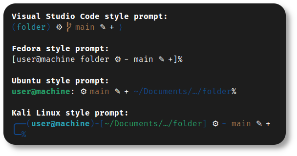
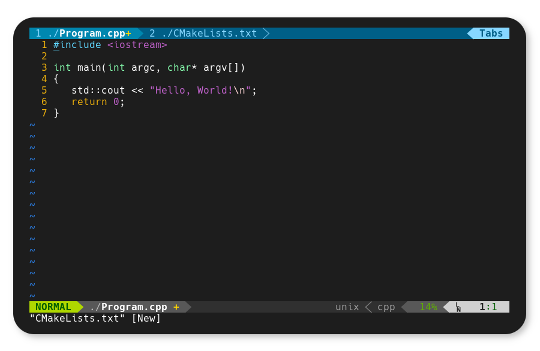
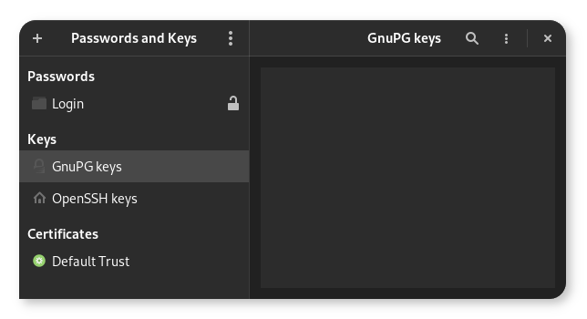

<h1 align="center">
	
	<br>Pop!_OS Setup<br>
</h1>
<p align="center">
  <a href="https://github.com/nico-castell/PopOS-Setup/commits"></a>
  <a href="https://github.com/nico-castell/PopOS-Setup/releases"></a>
  <a href="LICENSE"></a>
  <a href="https://github.com/nico-castell/PopOS-Setup"></a>
</p>

<h2 align="center">How to use</h2>

I'm assuming you have just installed [Pop!_OS](https://pop.system76.com/) successfully.

1. Clone this repo
    ```shell
    $ git clone https://github.com/nico-castell/PopOS-Setup.git
    ```
2. Given that the main branch is always under development, you might want to checkout the last tag, which will be the last known stable version.
    ```shell
    $ git checkout $(git describe --tags --abrev=0) # Go to the last tag
    $ git checkout main                             # Go back to main
    ```
3. (Optional) Look at the instuctions in thme [gnome_apperance](scripts/gnome_appearance.sh) script, and configure the file structure for the script to set up the GNOME appearance with your themes.
    ```
    scripts
    └── themes
        ├── background
        │   └── image.png
        ├── cursor
        │   └── cursor.tar.gz
        ├── icons
        │   └── icons.tar.gz
        └── theme
            └── theme.tar.gz
    ```
4. (Optional) If you plan on building a minecraft server, you should check that the `$download_link` and `$version` variables are up to date, they're always market as `TODO` to be easy to find.
5. Run the [popOS_setup.sh](popOS_setup.sh) script.
    ```shell
    $ ./popOS_setup.sh
    ```
6. Follow the instructions from the script.
7. Wait, this script will as for further instructions as it goes about doing it's thing.

<h2 align="center">Keep in mind</h2>

- You **must** have an internet connection to run the script.
- If you choose to update the backup image, it will have to download an entire image of [Pop!_OS](https://pop.system76.com/). So it can take very long, depending on your internet connection.
- If you're using an older nvidia GPU not supported by the latest nvidia driver, it might be better to download the [Pop!_OS](https://pop.system76.com/) ISO without their custom driver, and then choose the latest driver that supports your GPU from the list the script offers. (I'm talking from experience)

<h2 align="center">Biggest features</h2>

This project can set up some powerful features, such as:

- Advanced, stylized prompts for the **Z-Shell**:
  <p align="center"></p>
- Powerline plugin for the **Vim** editor:
  <p align="center"></p>
- Setting up **GnuPG** to sign **Git** commits:
  <p align="center"></p>
- Easily expandable lists of packages for the script to work with: [packages.txt](packages.txt), [flatpaks.txt](flatpaks.txt) and [remove.txt](remove.txt)
- Desktop entry files that you can add at your convenience.
- A [script](scripts/mc_server_builder.sh) to set up a minecraft server.
- A [script](back_me_up.sh) to back up your home directory.
- A [script](scripts/update_recovery.sh) to update your recovery partition.

<h2 align="center">Known issues</h2>

1. [*duc_noip_install*](duc_noip_install): The installer can't seem to understand symbols when typing a password, at least on my tests, the script opens *gedit* for you to copy/paste your password and work around the issue.
2. [*mc_server_builder*](mc_server_builder): The link to download the latest version of the server must be manually updated for every minecraft release.

<h2 align="center">Licensing</h2>

This repository, and all contributions to this repository, are under the [MIT License](LICENSE). This software can also install packages under different licenses, this project's license doesn't apply to them, see each package.

> *Live long, and prosper*.  
> *Spock*
